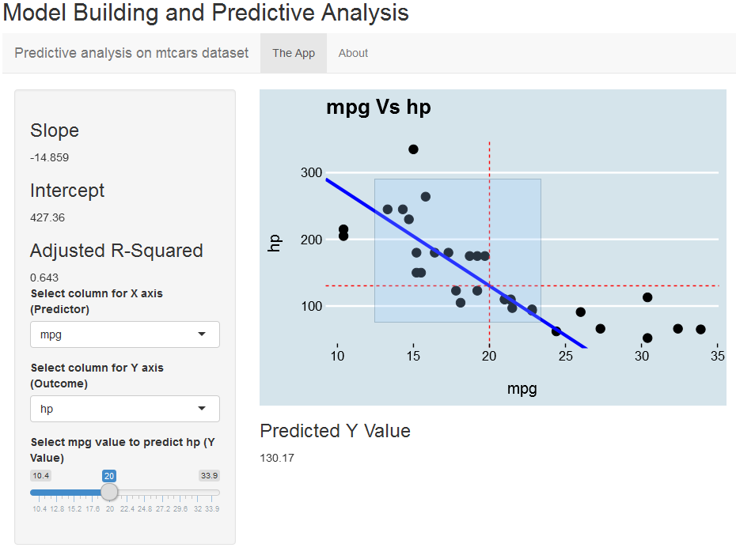

Developing Data Products: Shiny Presentation
========================================================
author: Perry501
date: 07 March 2017
autosize: false

Synopsis
========================================================

The purpose of this presentation is to 'sell' my Shiny App, built for the Developing Data Products Coursera class. The App focuses on the "mtcars" dataset and is built with dynamicity for the user in mind.

Hopefully, by the end of this presentation, you (the user) will have a better understanding of how to use and interpret the Shiny App.

What is my Shiny App?
========================================================

My Shiny App uses linear modelling to calculate predicted outcomes. The user will follow these steps:

1. The user is to select any variable in the dataset to be either the 'Predictor' or the 'Outcome'.
2. Highlight on the plot the data points they would like included in the linear model and prediction calculation.
3. Use the slider to select a value for which the prediction function will calculate a Y value (Outcome).

The dynamic nature of the App gives the user opportunity to make numerous predictions, it's multiple applications squeezed into one!

App Layout
========================================================

<div align = "center">

</div>

The screenshot above shows just how user friendly the app is. With regards to interpreting the plot itself; the blue line is the linear model of the highlighted points, while the red dashed lines give the visual representation of the prediction of the Y value (i.e. vertical line = slider value, horizontal line = predicted Y value).

Example code used in my Shiny App
========================================================

Below is an example of the modelling and prediction functionality used in the App. Although the App has the flexibility to adapt to the options selected by the user, we will fix the variables below and use all data points in the dataset. In the example, we want to predict the hp of a car that does 20 mpg.


```r
model <- lm(formula = hp ~ mpg, data = mtcars)
prediction <- predict(model, newdata = data.frame(mpg = 20))
paste0("The predicted hp of a car that does 20 mpg is ", round(prediction, digits = 2))
```

```
[1] "The predicted hp of a car that does 20 mpg is 147.49"
```
